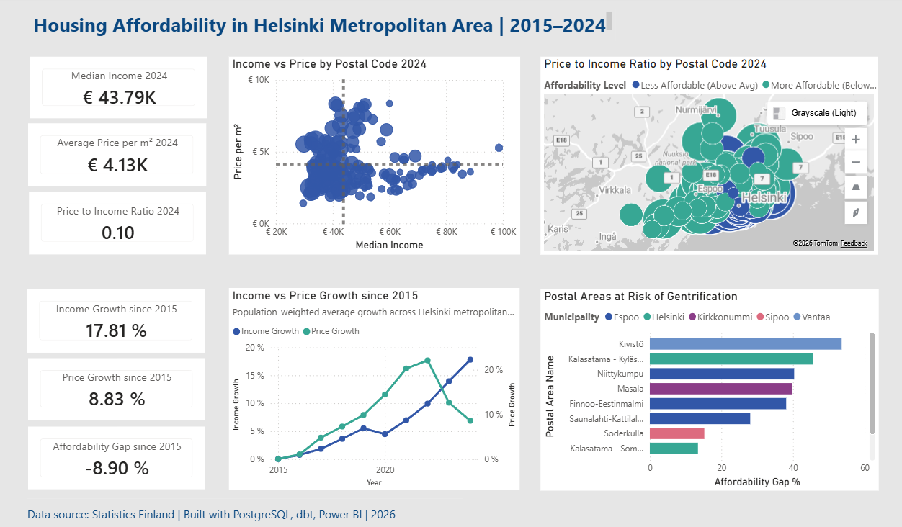

# Helsinki Metropolitan Area — Housing Affordability Analysis

An end-to-end analytics project analyzing housing affordability trends 
using public data from Statistics Finland, built for urban planners and policy-makers 
to identify affordability pressures and gentrification risk across the Helsinki metropolitan area.

---

## Project Overview

This project investigates whether housing in the Helsinki metropolitan area 
is becoming less affordable over time by tracking the gap between housing 
price growth and income growth since 2015.

**Key Questions:**
- How have housing prices and incomes grown since 2015?
- Which postal codes are least affordable relative to local incomes?
- Which areas show the highest gentrification risk?

---

## Tech Stack

| Layer | Tool |
|---|---|
| Data Ingestion | Statistics Finland PxWeb API + Python |
| Data Storage | PostgreSQL |
| Data Modeling | dbt |
| Data Visualization | Power BI (Power Query + DAX) |

---

## Data Sources

All data is publicly available from Statistics Finland:

| Dataset | Description | Coverage |
|---|---|---|
| Household Population | Number of households by postal code | 2015–2024 |
| Median Income | Median income by postal code | 2015–2024 |
| Housing Prices | Price per m² by postal code | 2015–2024 |

---

## Data Model

### Star Schema

dim_date ─────── fct_housing_metrics ─────── dim_location

### Layers

| Layer | Models | Description |
|---|---|---|
| **Staging** | stg_household, stg_income, stg_price | Raw data cleaning and standardization using custom dbt macros |
| **Marts** | dim_location, dim_date, fct_housing_metrics | Star schema fact and dimension tables |
| **Reporting** | rpt_housing_affordability | Flattened reporting table with all KPIs |

---

## Key Metrics

| Metric | Definition |
|---|---| 
| Income Growth vs 2015 | % change in median income since 2015 baseline |
| Price Growth vs 2015 | % change in price per m² since 2015 baseline |
| Affordability Gap | Price growth minus income growth since 2015 |
| Price to Income Ratio | Price per m² divided by median income |
| Affordability Level | Above/below metro average price to income ratio |

---

## Dashboard

The Power BI dashboard consists of 6 visuals:

- **KPI Cards** — median income, price per m², price to income ratio (2024) / population-weighted
- **Bubble Scatter Plot** — income vs price per m² with population as bubble size
- **Map** — price to income ratio by postal code with population as bubble size
- **Growth Cards** — income growth, price growth, affordability gap since 2015 / population-weighted
- **Dual Line Chart** — income vs price growth trends 2015–2024 / population-weighted
- **Bar Chart** — top 10 postal codes at highest gentrification risk

---
